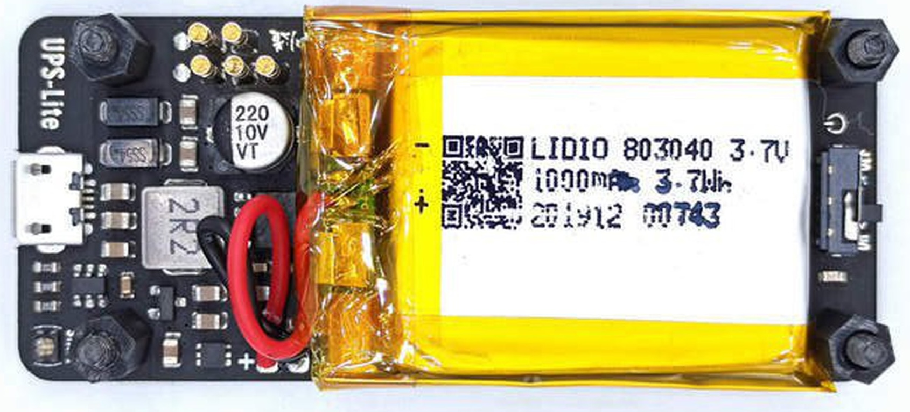
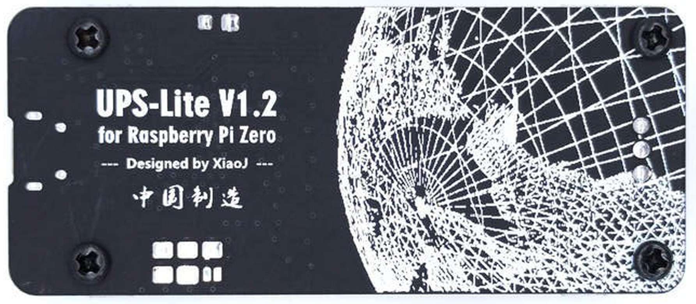
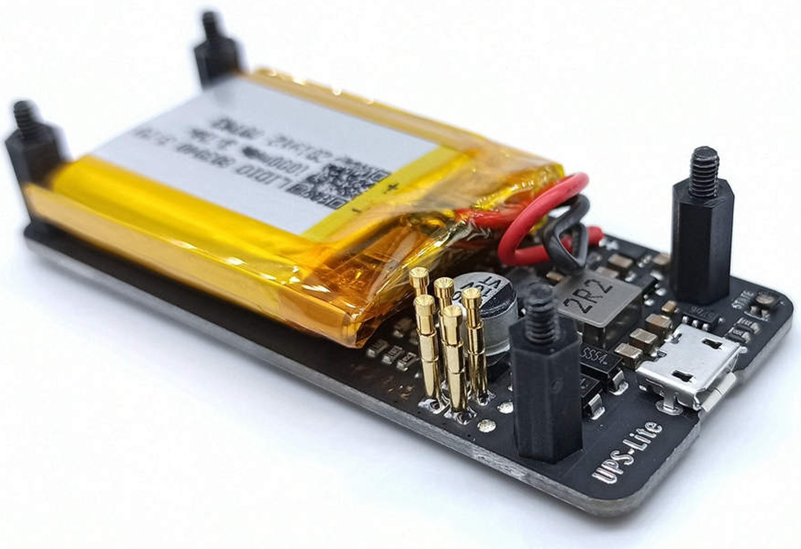
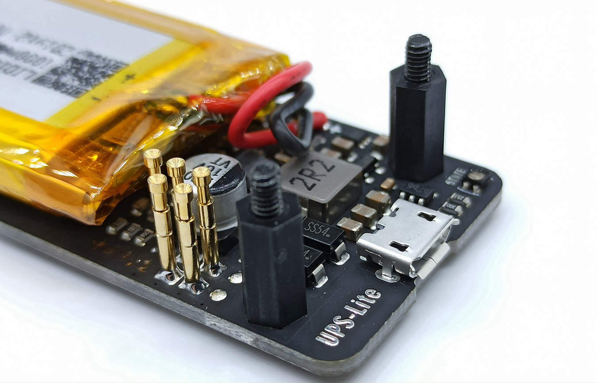
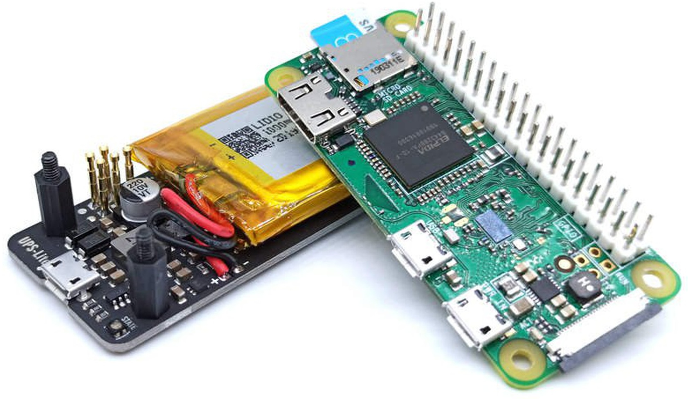
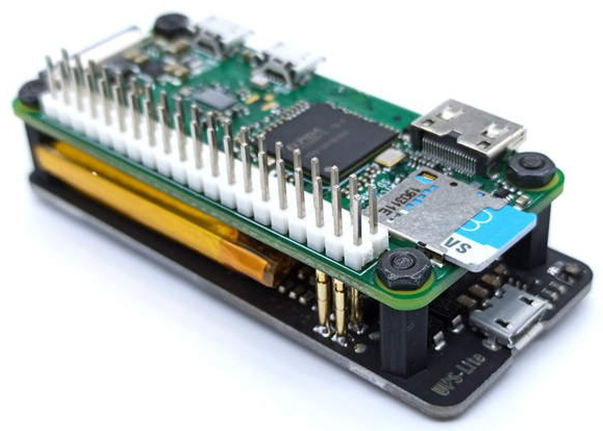
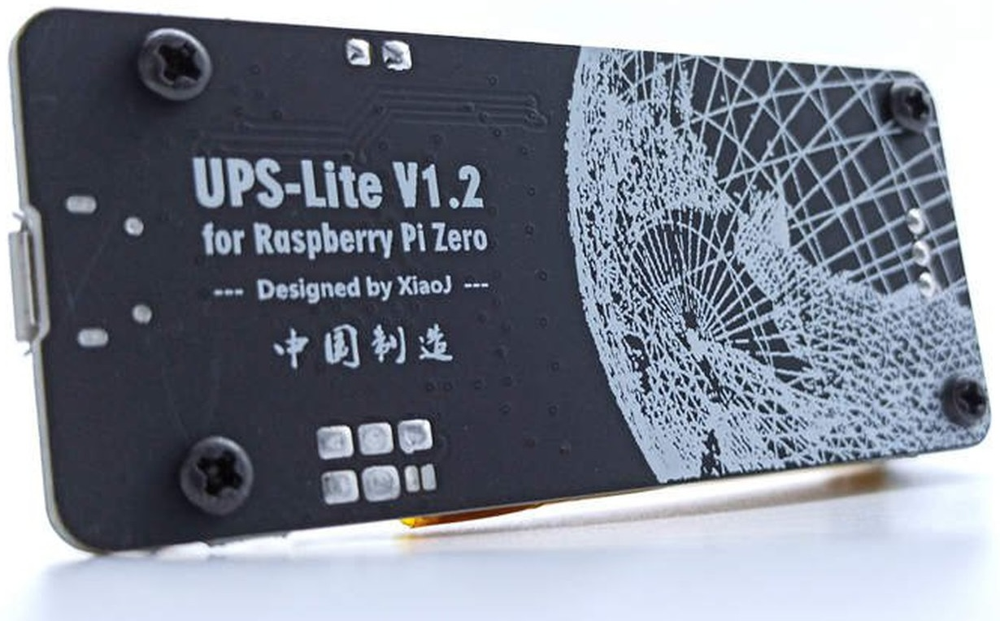
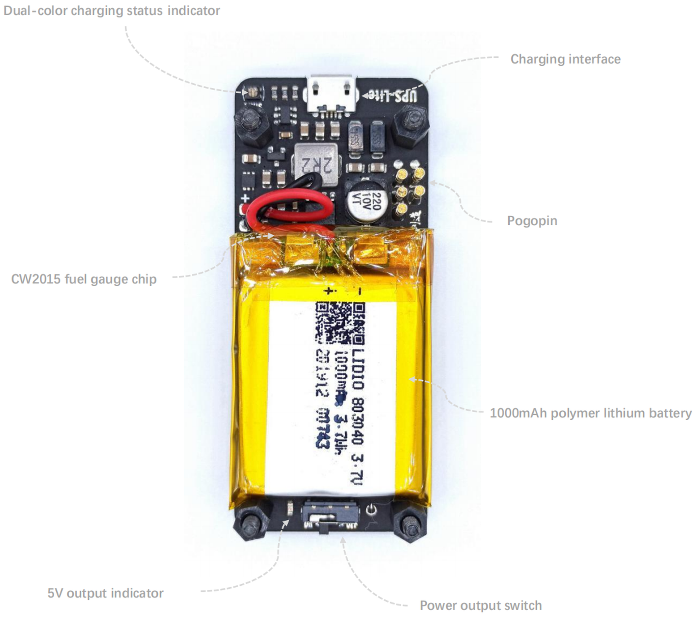

# UPS-Lite

UPS-Lite is a UPS power supply specially designed for the Raspberry Pi Zero. It uses a 1000mAh polymer lithium battery for power supply, supports external power supply insertion detection, supports charging and discharging while supporting battery power detection. Support battery level detection.

#### Parameters:
- Charging current: 400mA
- Output voltage: 5V ±0.1V
- Output current: 1.3A@5V (Without external adapter, only battery powered)
- 2A@5V (When inserting external adapter)
- Electricity measurement accuracy: error±2% ±3mV
- Package include: 1 X UPS-Lite （include battery)

